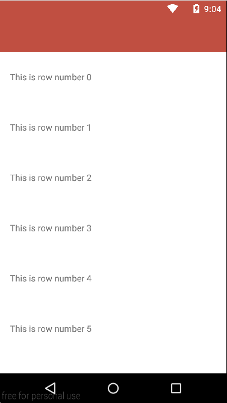

android-swipe-to-dismiss-undo
=============================

Library to make the items in a `ListView` or `RecyclerView` dismissable with the possibility to undo
it, using your own view to provide this functionality like the Gmail app for Android does.

Add the following to your `build.gradle`:

    repositories {
		mavenCentral()
	}

	dependencies {
		compile 'com.hudomju:swipe-to-dismiss-undo:1.0'
	}
	
**Or**:

* [Download the latest .jar file][https://oss.sonatype.org/content/repositories/releases/com/hudomju/swipe-to-dismiss-undo/1.0/swipe-to-dismiss-undo-1.0-sources.jar]
* Add the .jar files to your project's `libs` folder, or add them as external jars to your project's
 build path.

Create a Layout
===============

To make an item in the list dismissable, you need ot place a ViewGroup (i.e. FrameLayout) as the 
root view of your layout. Inside the ViewGroup, add one view that contains the main content for 
the row (your primary layout when the row hasn't been dismissed yet) and another view that contains 
the contents of the dismiss layout (i.e. with an undo button).

For example, the following layout uses a FrameLayout with two child views: a TextView to contain 
the main content (populated by an Adapter at runtime), and a LinearLayout for the undo layout.

    <?xml version="1.0" encoding="utf-8"?>
    <FrameLayout
        xmlns:android="http://schemas.android.com/apk/res/android"
        android:layout_width="match_parent"
        android:layout_height="wrap_content"
        android:id="@+id/lyt_container"
        android:background="@color/gray_background">

        <TextView
            android:layout_width="match_parent"
            android:layout_height="wrap_content"
            android:height="@dimen/list_item_height"
            android:gravity="center_vertical"
            android:paddingLeft="@dimen/list_item_padding_sides"
            android:paddingRight="@dimen/list_item_padding_sides"
            android:id="@+id/txt_data"
            android:background="@android:color/white"/>

        <LinearLayout
            android:layout_width="match_parent"
            android:layout_height="match_parent"
            android:orientation="horizontal"
            android:visibility="gone"
            android:weightSum="3"
            android:height="@dimen/list_item_height"
            android:paddingLeft="@dimen/list_item_padding_sides"
            android:paddingRight="@dimen/list_item_padding_sides">

            <TextView
                android:layout_width="0dp"
                android:layout_height="match_parent"
                android:id="@+id/txt_delete"
                android:gravity="center_vertical"
                android:text="@string/deleted"
                android:clickable="false"
                android:layout_weight="2"
                android:hapticFeedbackEnabled="true"
                android:textColor="@android:color/white"/>

            <TextView
                android:layout_width="0dp"
                android:layout_height="match_parent"
                android:gravity="center"
                android:id="@+id/txt_undo"
                android:text="@string/undo"
                android:clickable="false"
                android:layout_weight="1"
                android:textColor="@color/yellow"/>

            </LinearLayout>

    </FrameLayout>

NOTE that the second child in the layout (here the LinearLayout), must have the visibility set to
GONE, or both the data and the undo layout will be displayed in the row at the same time.

Usage
==============

With a `ListView`:

	final SwipeToDismissTouchListener<ListViewAdapter> touchListener =
	                new SwipeToDismissTouchListener<>(
	                        new ListViewAdapter(listView),
	                        new SwipeToDismissTouchListener.DismissCallbacks<ListViewAdapter>() {
	                            @Override
	                            public boolean canDismiss(int position) {
	                                return true;
	                            }
	                            
	                            @Override
                                public void onPendingDismiss(ListViewAdapter recyclerView, int position) {
    
                                }
	
	                            @Override
	                            public void onDismiss(ListViewAdapter view, int position) {
	                                adapter.remove(position);
	                            }
	                        });
	// Dismiss the item automatically after 3 seconds
	touchListener.setDismissDelay(3000);
	
	listView.setOnTouchListener(touchListener);
	listView.setOnScrollListener((AbsListView.OnScrollListener) touchListener.makeScrollListener());
	listView.setOnItemClickListener(new AdapterView.OnItemClickListener() {
	    @Override
	    public void onItemClick(AdapterView<?> parent, View view, int position, long id) {
	        if (touchListener.existPendingDismisses()) {
	            touchListener.undoPendingDismiss();
	        } else {
	            Toast.makeText(ListViewActivity.this, "Position " + position, LENGTH_SHORT).show();
	        }
	    }
	});

With a `RecyclerView`:

	final SwipeToDismissTouchListener<RecyclerViewAdapter> touchListener =
	                new SwipeToDismissTouchListener<>(
	                        new RecyclerViewAdapter(recyclerView),
	                        new SwipeToDismissTouchListener.DismissCallbacks<RecyclerViewAdapter>() {
	                            @Override
	                            public boolean canDismiss(int position) {
	                                return true;
	                            }
	                            
	                            @Override
                                public void onPendingDismiss(ListViewAdapter recyclerView, int position) {
    
                                }
	
	                            @Override
	                            public void onDismiss(RecyclerViewAdapter view, int position) {
	                                adapter.remove(position);
	                                adapter.notifyItemRemoved(position);
	                                adapter.notifyItemRangeChanged(position, adapter.getItemCount());
	                            }
	                        });
	// Dismiss the item automatically after 3 seconds
    touchListener.setDismissDelay(3000);
	
	recyclerView.setOnTouchListener(touchListener);
	recyclerView.setOnScrollListener((RecyclerView.OnScrollListener)touchListener.makeScrollListener());
	recyclerView.addOnItemTouchListener(new SwipeableItemClickListener(this,
	        new OnItemClickListener() {
	            @Override
	            public void onItemClick(View view, int position) {
	                if (view.getId() == R.id.txt_delete) {
	                    touchListener.processPendingDismisses();
	                } else if (view.getId() == R.id.txt_undo) {
	                    touchListener.undoPendingDismiss();
	                } else { // R.id.txt_data
	                    Toast.makeText(context, "Position " + position, LENGTH_SHORT).show();
	                }
	            }
	        }));

Special Thanks
==============

Romman Nurik for the initial contribution with [swipe to dismiss](https://github.com/romannurik/Android-SwipeToDismiss) for `ListView`

See the original [Google+ post](https://plus.google.com/+RomanNurik/posts/Fgo1p5uWZLu) for discussion.

See also [Jake Wharton's port](https://github.com/JakeWharton/SwipeToDismissNOA) of this sample code to old versions of Android using the [NineOldAndroids](http://nineoldandroids.com/) compatibility library.

